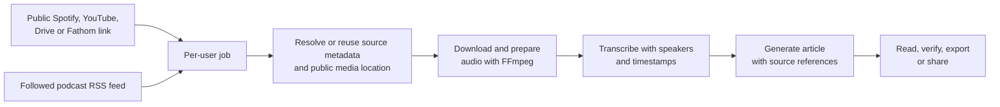

# Podcast2Article

Podcast2Article is an open-source Node.js app that turns a **public Spotify
podcast episode, YouTube video, Fathom recording, or Google Meet recording** into:

1. a transcript with speaker labels and timestamps;
2. a clear blog article that retains the recording's distinctive style;
3. verifiable source links from each article paragraph to the relevant transcript
   passage and audio timestamp.

Completed articles appear automatically on the
[`/articles`](http://localhost:3000/articles) page, newest first. You can mark
articles as read and undo that choice; the status is stored locally with the job.
Queued and processing jobs appear at the top with their current stage and
progress. This part of the overview refreshes automatically.

Source references open a dialog alongside the article, showing the relevant
transcript passage and audio from the selected timestamp. Closing the dialog or
pressing Escape pauses the audio and returns you to the same reference. Shared
articles expose only playback controls; the private transcript remains protected.
Table-of-contents links preserve both the article and section, including after a
refresh.

Audio is not downloaded from Spotify. The app uses the Spotify link to identify
the episode, then finds the same episode through the public Apple Podcasts index
and the original public audio source.
For public YouTube videos, it downloads only the best available audio stream.
Playlists, active livestreams, and videos requiring sign-in are not processed.
Google Meet recordings are retrieved through a public Google Drive link. The app
creates a compact local audio version for reliable playback and timestamp links;
the original video file is deleted after processing.

For a Meet recording, paste the recording file's Drive link, such as
`https://drive.google.com/file/d/.../view`. Set general access in Drive to
**Anyone with the link** and allow viewers to download the file. A
`meet.google.com/...` meeting-room link does not contain a recording file and is
therefore rejected.

For Fathom, use the public share link `https://fathom.video/share/...`.
Copy it through **Share** and choose **Anyone with the link**. Internal
`fathom.video/calls/...` links require sign-in and are rejected.
The app uses yt-dlp to retrieve the recording, then creates the same local audio
and transcript files as it does for Drive. Existing Fathom summaries and
transcripts are not imported. No Fathom API key is needed; cookies, private
recordings, and team-restricted access are not supported. Downloads are subject
to `MAX_RECORDING_MB` and `MEDIA_DOWNLOAD_TIMEOUT_MS`.

## Design

The [brand guidelines](docs/BRAND.md) describe the visual identity, typography,
colors, interactions, and intended use of rounded corners. Use them alongside
[AGENTS.md](AGENTS.md) when changing the interface.

The [user journeys](docs/USER-JOURNEYS.md) describe what people want to achieve,
which features support those outcomes, and how we can test their value. The
[accessibility review](docs/ACCESSIBILITY-AUDIT.md) records the screens checked,
issues found, and remaining limitations.

## Quick start

Requirements: Node.js 24+, Yarn 1.22.22, Python 3.11+, and an OpenAI API key.
FFmpeg and yt-dlp are bundled as Node dependencies. yt-dlp uses Python on macOS
and Linux. PDFs are generated directly in Node.js; no server-side browser is
required.

Set `FFMPEG_BIN` to the absolute path of a separately installed FFmpeg executable
to override the bundled binary. The production installer installs a pinned
FFmpeg/ffprobe build on Linux x64 with SHA-256 verification. An existing
`90-ffmpeg-override.conf` is preserved; activating a different version is an
explicit, reversible administrative action. With the current infrastructure
updater installed, every new release runs a real media test before activation.
Application pushes do not update that host script. See the [management and rollback runbook](docs/FFMPEG.md)
and the [incident report](docs/incidents/2026-08-28-fathom-ffmpeg.md).

Use Yarn 1.22.22 for dependency installation and scripts. The version is pinned
in `package.json`; `yarn.lock` is the dependency lockfile. If Yarn is missing,
install it once with `npm install --global yarn@1.22.22`. npm is only used to
bootstrap package-management tooling, including Corepack on the production host.
Do not generate a `package-lock.json`.

```bash
yarn install --frozen-lockfile
OPENAI_API_KEY='your-key' yarn run dev
```

Then open [http://localhost:3000](http://localhost:3000). The key stays in the
process and is not persisted by the app.

To run the compiled application locally:

```bash
cp .env.example .env
# Set OPENAI_API_KEY in .env; configure APP_USERS before exposing the app.
yarn run build
yarn start
```

For a managed production host, follow the [deployment guide](deploy/README.md),
which uses systemd and `/etc/podcast2article.env` instead of a release-local `.env`.
For a public installation, configure user accounts as JSON in the applicable environment file.
Each password must contain at least 16 characters. Sign-in uses a signed
`HttpOnly` cookie valid for 30 days, which is automatically invalidated when the
account configuration changes:

```bash
APP_USERS='{"rogier":"a-long-unique-password","melvin":"another-unique-password"}'
```

Leaving both `APP_USERS` and the legacy `APP_PASSWORD` unset disables
authentication for local development. `APP_PASSWORD` alone enables the legacy
`rogier` account; new installations should use `APP_USERS`.
Always put production installations behind HTTPS, for example through Caddy or
Nginx. After five failed attempts from the same IP address, sign-in blocks new
attempts for fifteen minutes.

For regional OpenAI processing in the EU or US, set `OPENAI_REGION=eu` or
`OPENAI_REGION=us` respectively in `.env`. `yarn start` reads the variables from
that file:

```bash
OPENAI_REGION=eu
```

## How it works



See the [service flow diagrams](docs/SERVICE-FLOWS.md) for request validation,
processing stages, failure recovery, podcast subscriptions, budget enforcement,
and the boundary between owner access and public permalinks.

Jobs are stored per user as JSON in `data/users/<username>/jobs/`.
Compact playback audio is stored in `data/users/<username>/media/`; downloaded
source files and transcription chunks are deleted. Users can access only their
own jobs, articles, transcripts, and audio through owner routes. Public permalinks
separately grant access to one completed article and its audio.
Unfinished jobs restart automatically after a server restart with the same job ID.
Up to three jobs are processed concurrently. Downloads and FFmpeg run one at a
time; transcription and article generation can overlap with other jobs. Source
metadata is fetched separately, with up to three concurrent requests, so titles
and images already appear in the queue. Incomplete jobs restart through the full
pipeline, even when a transcript already exists. This avoids stuck jobs but can repeat downloads, transcription, and paid
API work; durable stage recovery remains unfinished.

Each new job stores API usage in `apiUsage` in the same JSON file. For each
transcription chunk and article request, it records the model, requested and
reported service tier, request ID, duration, usage figures, and attempts.
Automatic retries each get their own record. Usage from a successful API request
is retained even when the resulting article content is rejected.

`knownEstimatedCostUsd` sums known USD estimates and is stored with the article
in the job JSON. These amounts are not recalculated against the current price
table when loaded. `unknownCostRequests` counts attempts with unknown costs.
A missing amount is `null`, not zero. Estimates use stored prices dated
19 September 2026: reported audio duration for `gpt-4o-transcribe-diarize`, and
tokens, cache breakdown, context length, reported service tier, and any regional
surcharge for `gpt-5.6-terra` and `gpt-5.6-sol`. Other models and custom API endpoints
still record usage but receive no cost estimate. Prices are in
`src/services/api-usage.ts`; each estimate stores the prices and source used, so
historical amounts do not change when prices are updated. According to OpenAI,
promotional pricing for `gpt-5.6-sol` applies until at least 21 November 2026.
Existing jobs are not automatically repriced.

These are API cost estimates, not invoice amounts. Hosting, downloads, and FFmpeg
costs are excluded. Historical costs remain unchanged in the ledger: missing
`apiUsage` means unknown, and a new attempt on such a job sets `coverage` to
`partial`. After a hard stop, an attempt may remain `pending` with unknown costs.
Usage data is available through the owner's job and account summary, never through
public links or saved copies.

Each account has a USD 5 processing limit over the preceding 30 days. Historical
requests made before budget enforcement are excluded from this allowance, including
known historical costs. New requests reserve budget before sending; confirmed costs
replace reservations, while uncertain outcomes retain them. Reservations can block
work before actual estimates reach USD 5. Article output is capped at 16,384 tokens.

Open **Usage** in the account footer to see estimated 30-day spend, excluded
historical costs, reserved budget and the remaining allowance. Operators can set
`SPENDING_LIMIT_EXEMPT_USERS=rogier` (comma-separated exact usernames) to exempt
accounts while continuing to track their costs. Limited accounts cannot use models
or endpoints without verified reservation pricing. See the [budget runbook](docs/OPERATIONS.md#account-processing-budget)
for configuration, restart and revocation behavior.

On `SIGINT` or `SIGTERM`, the server stops accepting requests and cancels all
active OpenAI HTTP requests through `AbortSignal`. Interrupted jobs are saved as
resumable, temporary audio is cleaned up, and the process waits up to 15 seconds
for graceful shutdown. Closing the HTTP request is the available client-side
cancellation mechanism; the API provides no separate server-side cancellation
endpoint for transcription requests.

## Sharing and monitoring

Article actions create a stable anonymous permalink. Recipients can read and play
source audio without an account; signed-in recipients can save an independent
copy in their own library. Deleting the original disables its permalink while
preserving previously saved copies. Public pages never expose the owner's
identity, private transcript, read state, API costs, or usage statistics.

Shared pages skip monitoring when the browser declares WebDriver automation.
Other visits record a load only after two consecutive seconds in a visible tab. An estimated read
requires 30 seconds of visible, active reading and at least 90% scroll progress.
Counts survive restarts and are available to the owner through
`GET /api/jobs/:id/share-stats` and in **Shared link activity** at the bottom of
the owner article. The footer shows shared loads and estimated shared reads, including
zero counts, and offers a retry when statistics are unavailable. These count
page visits, not unique people or confirmed comprehension. They do not change
**Mark as read** in the owner's library.

See [shared article monitoring](docs/SHARED-ARTICLE-MONITORING.md) for API examples,
privacy, deduplication, and measurement limits. Set `PUBLIC_BASE_URL` to the
canonical external origin for permalink and social-preview URLs in production.

## Configuration

### Interface language

The interface follows the primary browser language: Dutch (`nl`, `nl-NL`,
`nl-BE`, and related variants) uses Dutch text; all other languages fall back to
English. This also applies to error messages, dates, and fixed labels in PDF
exports. The language setting for article generation is independent.
Articles and transcripts are not translated again when the interface language
changes.

Shared translations live in `public/i18n.js`, using semantic keys such as
`article.delete` and `nav.articles` rather than Dutch text as keys. Tests
automatically check all HTML templates and browser modules for missing
translations, including accessibility labels and singular/plural forms.
The server uses `Accept-Language` for the initial HTML response; browser requests
include the selected interface language. Refresh the page after changing the
browser language.

| Variable                          | Default                     | Meaning                                                                                                   |
| --------------------------------- | --------------------------- | --------------------------------------------------------------------------------------------------------- |
| `OPENAI_API_KEY`                  | required for processing     | OpenAI API key supplied through the process environment or environment file                               |
| `APP_USERS`                       | empty                       | JSON account map; empty disables authentication only if legacy `APP_PASSWORD` is also absent              |
| `SPENDING_LIMIT_EXEMPT_USERS`     | empty                       | Comma-separated usernames exempt from spending limits; usage stays tracked                                |
| `OPENAI_REGION`                   | `global`                    | OpenAI API region: `global`, `eu` (EEA + Switzerland), or `us`                                            |
| `OPENAI_BASE_URL`                 | region-selected endpoint    | Advanced endpoint override; custom endpoints have no verified cost estimate or reservation pricing        |
| `HOST`                            | `127.0.0.1`                 | Network interface; consider `0.0.0.0` only inside a container                                             |
| `PUBLIC_BASE_URL`                 | request origin              | Canonical external origin for permalinks and social previews                                              |
| `PORT`                            | `3000`                      | HTTP port                                                                                                 |
| `ARTICLE_MODEL`                   | `gpt-5.6-terra`             | Article generation model                                                                                  |
| `TRANSCRIPTION_MODEL`             | `gpt-4o-transcribe-diarize` | Transcription model                                                                                       |
| `MAX_AUDIO_MB`                    | `500`                       | Maximum Spotify/RSS audio download size                                                                   |
| `MAX_YOUTUBE_MB`                  | `500`                       | Maximum YouTube audio download size                                                                       |
| `MAX_RECORDING_MB`                | `1500`                      | Maximum Google Drive or Fathom recording download size                                                    |
| `YOUTUBE_METADATA_TIMEOUT_MS`     | `60000`                     | YouTube metadata timeout (1 minute)                                                                       |
| `MEDIA_DOWNLOAD_TIMEOUT_MS`       | `900000`                    | Media download timeout (15 minutes)                                                                       |
| `FFMPEG_BIN`                      | bundled binary              | Absolute path to an alternative FFmpeg executable for normalization, splitting, and Fathom postprocessing |
| `AUDIO_CHUNK_SECONDS`             | `300`                       | Audio chunk length (5 minutes; allowed range: 60–1200)                                                    |
| `OPENAI_TRANSCRIPTION_TIMEOUT_MS` | `600000`                    | Timeout per transcription chunk (10 minutes)                                                              |
| `OPENAI_ARTICLE_TIMEOUT_MS`       | `600000`                    | Article generation timeout (10 minutes)                                                                   |
| `LOG_STACKS`                      | `false`                     | Show full error stacks in the CLI                                                                         |

For each job, the CLI reports source resolution, download and FFmpeg duration,
chunk sizes, OpenAI start and completion times, and a heartbeat every 30 seconds
while an OpenAI request is running. API keys and transcript content are not logged.

`OPENAI_REGION` selects the OpenAI API endpoint for both transcription and article
generation. Regional data residency must also be configured for the OpenAI project
in use and depends on the selected models and features.

If only article generation fails and the transcript is already complete, the
existing transcript can be reused without new audio or transcription costs:

```bash
curl -X POST 'http://localhost:3000/api/jobs/<job-id>/retry-article'
```

Replace `<job-id>` with the failed job's ID. This example assumes local mode
without authentication; authenticated installations also require the owner's
session cookie. The interface sends that cookie when using its retry action.

This is available only for failed jobs, with at most two attempts per job in
addition to the original generation. Every accepted attempt counts, including
failed attempts. The counter is saved before paid work starts and survives
restarts. Completed articles and jobs that have reached the limit return `409`;
their content and read status remain intact.

For older jobs without a counter, recorded article operations count as previous
attempts. The initial generation is subtracted only when usage history is complete;
partial histories count all known operations. Automatic API retries within the
same operation count together as one attempt. Without recorded history, the
counter starts at zero; unknown earlier attempts cannot be reconstructed.
This limit applies to article regeneration, not to new jobs or the remaining
restart-recovery work.

The length selector shows target word counts: compact (700–1,000), standard
(1,100–1,700), and extended (1,800–2,600). These are generation guidelines, not
guaranteed counts. The same source can be processed again in a different language
or length. Only an existing or active job with the same source, language setting,
and length counts as a duplicate. Automatic language detection remains a separate
choice from an explicit language.

## Limitations

- Public `open.spotify.com/episode/...` links, YouTube video, Shorts, and completed
  livestream links, public Fathom share links, and Google Drive links to a single
  public audio or video file are accepted.
- The episode must also appear in a public podcast index or RSS source. Spotify
  exclusives do not work.
- Titles that differ substantially between Spotify and the RSS source cannot be
  matched automatically; the app deliberately selects no source when uncertain.
- YouTube playlists, active or scheduled livestreams, private videos, and videos
  requiring sign-in are not supported.
- A Drive recording must be accessible to anyone with the link and allow
  downloads. Recordings restricted by Workspace policy deliberately do not work
  without Google authentication.
- Meet room, Drive folder, and Google Calendar links do not point directly to a
  recording file and therefore do not work.
- Speaker labels may change between long audio chunks. Text and timestamps remain
  linked.
- Transcription and rewriting can introduce errors. Timestamp links make it easier
  to check articles before publication.

## Responsible use

Use only recordings you are legally permitted to process. A public link does not
automatically grant permission to commercially republish a full transcript or
derived article. Respect copyright, image rights, privacy, licenses, and the
source's terms. Credit and link to the original recording.

## Development

GitHub Actions automatically runs formatting checks, ESLint, the TypeScript build,
and all tests on every pull request and push to `main`. These checks run as six
independent jobs, so a failure in one check does not prevent the others from
reporting results. The build job also checks browser-code syntax. The workflow can
be started manually through **Actions → Tests → Run workflow**. It uses the Node.js
version from `.nvmrc` and installs dependencies with the existing `yarn.lock`.

The workflow uses a standard Linux runner, which is
[free for public repositories](https://docs.github.com/en/billing/concepts/product-billing/github-actions).
These checks require no repository secrets or paid API calls. Runs time out after
15 minutes; a new run on the same branch or pull request cancels the previous run.

```bash
yarn test
yarn run check
yarn playwright install chromium webkit
yarn run test:browser
yarn run check:media
```

The browser job tests desktop Chromium and mobile WebKit. It retains the HTML
report, screenshots, and failure traces as Actions artifacts for 14 days. The media
job processes a synthetic recording with Ubuntu's FFmpeg through an explicit
`FFMPEG_BIN` setting. Browser and media tests run separately from `yarn run check`,
so existing production checks do not need to install browsers.

### Test limitations

- Known bugs use Playwright's `test.fail` and are listed separately in the Actions
  report. A green workflow does not mean these bugs are fixed. Once such a test
  passes, the suite fails until the annotation is removed.
- Mobile WebKit does not replace a physical iPhone. Native share sheets, focus
  zoom, status-bar taps, and Home Screen mode still require device checks.
- Browser tests block external requests, use fallback fonts, and mock some API
  responses. They do not compare pixels against previous screenshots. Server tests
  check the real API and storage boundaries separately.
- The media job checks the conversion pipeline with Ubuntu's FFmpeg, not the exact
  production executable or every codec. The download in
  `deploy/ffmpeg-release.json` was unavailable during verification (HTTP 404);
  repairing it and verifying the production binary remain separate work.
- Offline tests do not verify external model availability or quality. A green
  workflow does not confirm a production deployment either; see the
  [operational checks](docs/OPERATIONS.md).

Contributions are welcome. See [LICENSE](./LICENSE) for the MIT license.
Repository documentation is maintained in English. The app supports both Dutch
and English interfaces, with a separate choice for generated-article language.

### Following podcast series

On **Series**, add a Spotify show link or public RSS feed. Review the discovered
series. New episodes only is selected by default; optionally include the latest
three episodes. Before
confirmation, the screen shows how many episodes will be fetched for catch-up.
Each new processing job uses the configured paid transcription and article models.

The server checks active series at startup and every hour after that. It must keep
running; no external cron job is required. The existing queue processes up to three
recordings concurrently, while media preparation remains serial.
**Pause** stops new checks; jobs already in the processing queue still complete.
**Resume** also retrieves episodes missed during the pause, provided they are still
in the feed.

Series, skipped episodes, and episodes awaiting scheduling are stored per user in
`data/users/<username>/subscriptions.json`. This state is saved atomically and
survives restarts. Episodes are identified by feed URL and RSS GUID, falling back
to the audio link when no GUID exists. An already known audio link is also skipped.
Failed jobs appear with the series and are not restarted every hour. Failed feed
checks are retried automatically. Nothing new is scheduled without
`OPENAI_API_KEY`.

From a podcast article, choose **Follow this podcast** at the top or bottom. The
existing confirmation page opens with new episodes only selected by default;
fetching the latest three remains an explicit choice. If you already follow the
series, its status appears immediately, including any pause, with a link to series
management. For older Spotify articles, the feed is looked up through the stored
audio link. If it is no longer in the public index, the follow status cannot be
determined.

Spotify is used to find the series. When several search results exist, you choose
the correct public feed. Only audio episodes in RSS 2.0 are supported; Spotify
exclusives, paid feeds, and missing archive episodes without a public audio source
cannot be retrieved. Feeds use the same public-network checks as other sources,
with a 10 MB limit; DTDs and external XML entities are rejected.

Catch-up only offers episodes still in the feed's latest three, within the remaining
capacity. It never walks backward through the archive. New feed entries published
before you followed are excluded from automatic processing. For undated entries,
only entries before a previously seen episode in feed order are treated as new;
when there is no known episode to compare against, they are not scheduled automatically.

A series pauses automatically at five unread, queued, or processing episodes.
Read, deleted, and failed jobs do not count. After reading, you resume explicitly;
resuming respects the same limit. Already scheduled jobs are not cancelled, including
previously confirmed catch-up still awaiting scheduling. The latest-three action
preserves a manual pause.
