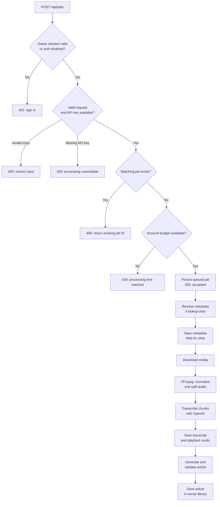
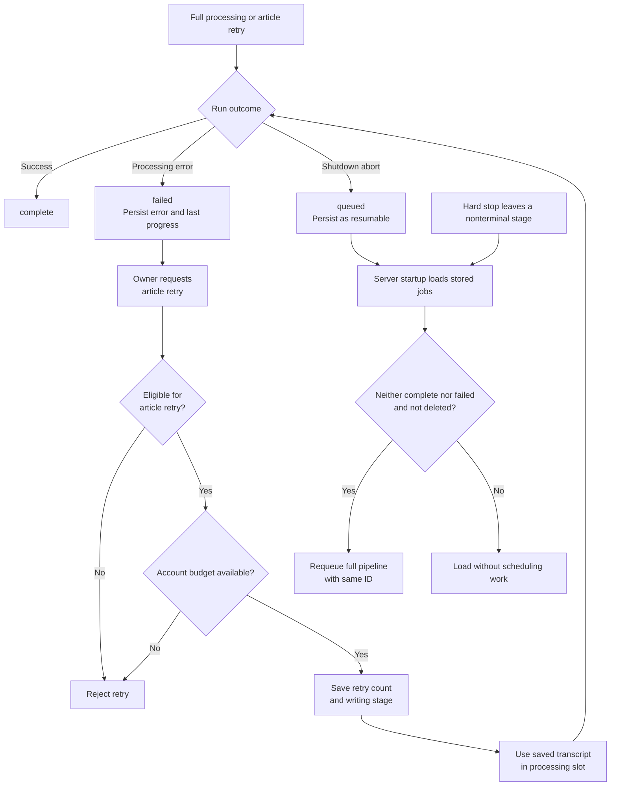
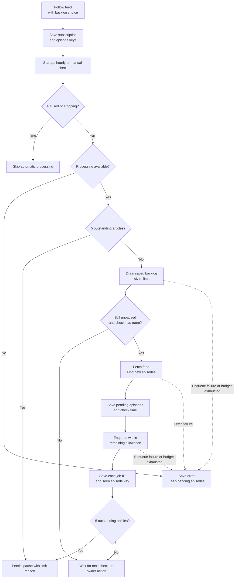
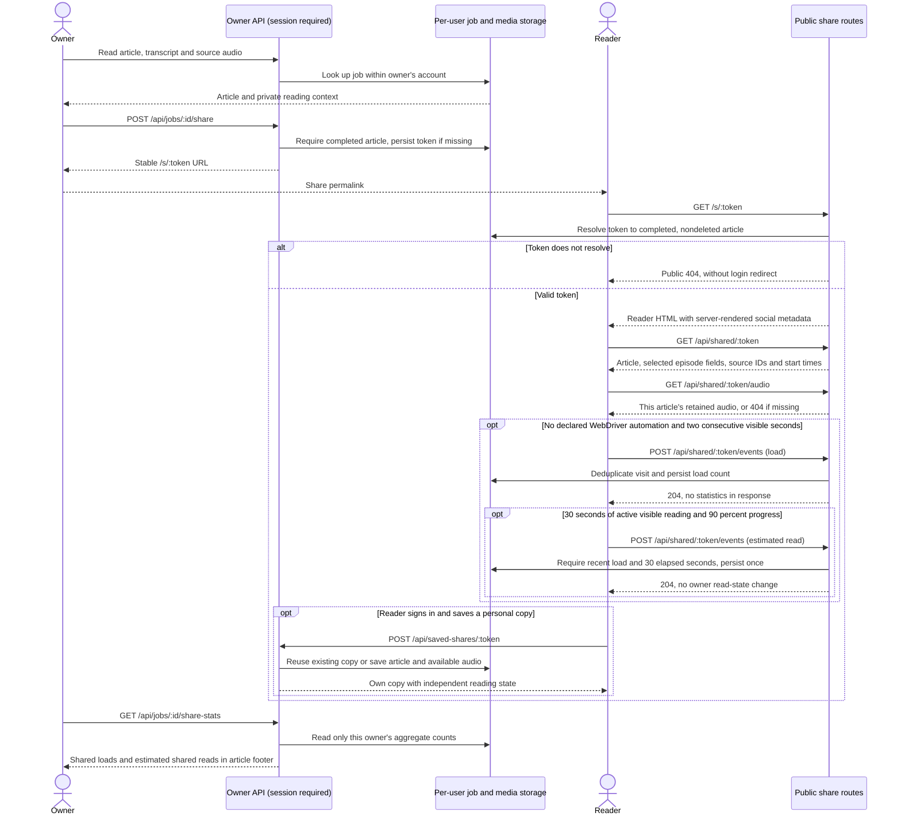
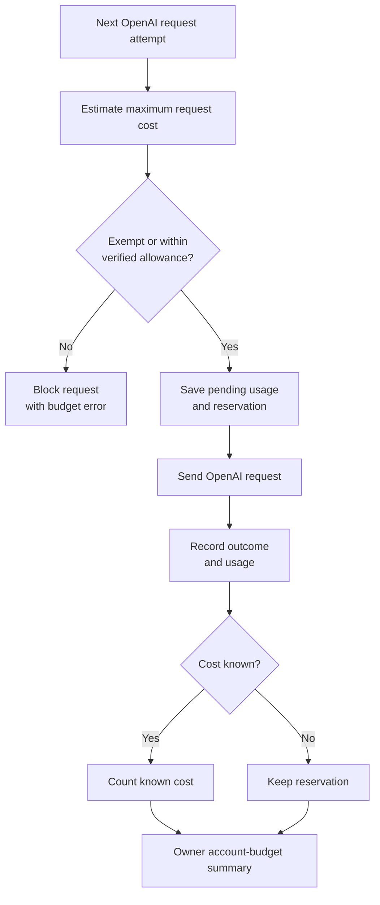
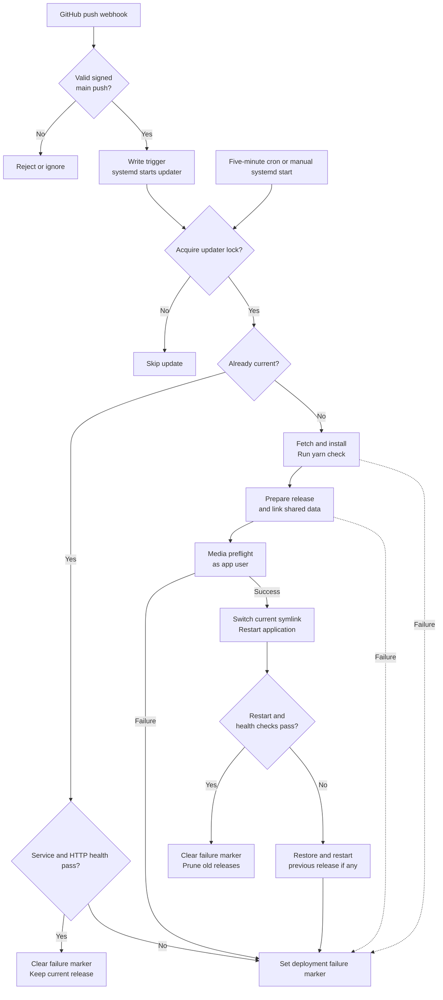

# Service flows

Podcast2Article turns public recordings into articles through a persisted job
queue. These diagrams describe the current implementation, including the paths
that stop processing or restrict access. They render in GitHub's Markdown viewer.
For user outcomes, see [user journeys](USER-JOURNEYS.md); for configuration and
recovery procedures, see the [README](../README.md) and [operations guide](OPERATIONS.md).

## Submit and process a recording

The owner submits a source URL, article language, and article length. A job is
saved before it enters the queue, so an accepted request survives a restart.
The browser polls job and library endpoints while processing continues. Duplicate
detection matches source, language, and length within the account and ignores
failed or deleted jobs.

Spotify resolution matches episode metadata against the Apple Podcasts index
and uses the matched public audio URL; it does not download Spotify audio.
YouTube and Fathom use yt-dlp. Drive uses public file metadata and downloads.
RSS subscription jobs already carry server-resolved episode metadata.

There are three processing slots shared by full jobs and article retries.
Downloads and FFmpeg share a single media slot. Metadata resolution happens
before acquiring a processing slot, allowing queued titles and images to appear
while other jobs transcribe or generate articles. Temporary files are removed
when the run finishes or fails; retained playback audio and job JSON live under
`data/users/<username>/`.

Sources: [request routes](../src/server.ts), [job processing](../src/services/jobs.ts),
[source resolution](../src/services/resolver.ts), and [OpenAI processing](../src/services/openai.ts).

## Final article backups

When S3 backups are configured, successful local completion requests a background
scan, including after an article-only retry. Startup and a one-minute timer also
scan existing completed articles, including soft-deleted articles. Incomplete and
failed jobs are skipped. Uploads contain only the final article and identifying
metadata; destination/content receipts skip unchanged objects. Failed uploads
leave local jobs complete and retry from persisted files after restart.

See [article backups](ARTICLE-BACKUPS.md) for payload exclusions, access controls,
backfill, retention, restore limitations and cost estimates.

## Failures, retries, and server restarts

An explicit article retry and restart recovery take different paths. Only the
explicit retry reuses the stored transcript. Restart recovery currently enqueues
the full pipeline, including audio download and transcription, even if an
interrupted job already has a transcript.

Retry eligibility requires a failed, inactive job with episode metadata and a
complete transcript, no saved-copy marker, and fewer than two accepted retries.
The retry count is saved before paid work starts, and failed attempts count
towards the two-retry limit. Automatic API retries within an operation are
separate from this owner-triggered allowance. Shutdown aborts active requests
and stops new work; a hard stop can leave pending usage records with unknown costs.

Sources: [retry, shutdown, and recovery helpers](../src/services/jobs.ts) and
[server shutdown](../src/server.ts).

## Follow a podcast series

Following a series stores the selected language and length, plus either no
backlog or the latest three episodes. Checks run at startup and hourly, and can
also be requested through the subscription API. Operations are serialized per
user so overlapping checks cannot overwrite subscription state.

Outstanding means active jobs plus unread completed articles for the series;
failed and deleted jobs do not count. Reading enough articles frees capacity,
but the owner must resume a paused subscription. Episode identity deduplication
prevents a crash between job creation and subscription persistence from creating
the same job again. New-episode selection checks publication time against the
follow date, or feed order relative to known episodes when dates are missing.
Explicit catch-up can process selected archive entries without clearing a manual pause.

Sources: [subscription store](../src/services/subscriptions.ts),
[subscription routes](../src/services/subscription-routes.ts), and
[podcast job creation and outstanding counts](../src/services/jobs.ts).

## Read, share, and save an article

Owner routes use the signed-in account's storage. Public routes resolve a
high-entropy capability token and are registered before authentication middleware.
A token grants read access only to its article and audio. It also allows anonymous
load/read events for that article; those events never change owner reading state,
grant access to the owner's library, or reveal private statistics.

Public payloads omit the username, internal job ID, token, reading state, usage
ledger, monitoring statistics, and transcript text. Saved copies retain only
source IDs and timestamps, not the private transcript, original owner's costs,
or analytics. Owner-only actions include
marking read, saving reading position, PDF export, and soft deletion. Soft deletion
hides the original from token lookup; public responses already cached may remain
available until their cache lifetime expires.
The owner footer loads counts when opening or returning to the article. A failed
request shows a retry action rather than zero. Reading through the owner's
library does not count; opening the public permalink can count even for its owner.
The two-second load delay is enforced by the browser, and
`navigator.webdriver === true` disables both events without blocking reading.
These checks filter some previews, but a capable crawler or direct event POST
can still affect totals. Load/read counters measure visits, not unique readers
or comprehension. Their deduplication window and client/server checks are described in
[shared article monitoring](SHARED-ARTICLE-MONITORING.md).

Sources: [public and owner routes](../src/server.ts),
[share tokens and copy persistence](../src/services/jobs.ts), and
[public reader](../public/share.js).

## Reserve and record API costs

Accepting a job does not reserve its entire future cost. Each transcription or
article API attempt must persist its own reservation before the request is sent.
This also applies to automatic API retries. Article requests default to Flex,
with three attempts before switching to explicit standard processing for up to
three more attempts. Both tiers share one operation ID. Only transient failures
are retried; cancellation and permanent errors stop immediately.
`ARTICLE_SERVICE_TIER=default` skips Flex and keeps three standard attempts.

The allowance is USD 5 over the preceding 30 days unless the operator exempts
the account. Historical requests without reservations do not consume this
allowance. Failed and deleted jobs still contribute their counted costs;
saving a shared article does not transfer costs. Estimates are stored with their
pricing basis and are not invoice amounts. See the
[budget runbook](OPERATIONS.md#account-processing-budget) for operational details.

Sources: [usage persistence](../src/services/jobs.ts),
[request tracking and pricing](../src/services/api-usage.ts), and
[account budget calculation](../src/services/account-budget.ts).

## Deploy a release and recover from failure

A signed push to `main` triggers the installed updater through an isolated webhook
receiver and systemd. Daily reconciliation invokes the same updater. GitHub Actions
runs separately; the updater does not wait for CI, so passing CI must be checked
before merging.

Failures before activation leave the old process and symlink in place. A failed
first deployment has no earlier release to restore. The application updater,
systemd units, Caddy configuration, and FFmpeg selection are host infrastructure:
merging application changes does not reinstall them. Confirm the installed
updater includes the media gate before relying on it. Historical rollout and
runtime-download limitations remain documented in the
[operations guide](OPERATIONS.md) and [FFmpeg runbook](FFMPEG.md).

Sources: [updater](../scripts/update-production.sh),
[webhook receiver](../scripts/github-webhook-server.mjs),
[update path](../deploy/podcast2article-update.path), and
[infrastructure installer](../deploy/install-infrastructure.sh).
